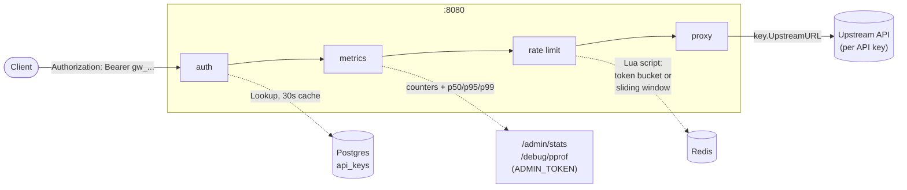

# api-gateway.

An API gateway: it sits in front of one or more upstream APIs, authenticates
callers with API keys stored in Postgres, rate-limits each key independently
(token bucket or sliding window, chosen per key), proxies whatever gets
through to that key's configured upstream, and exposes request counters and
latency percentiles for operators. Everything runs as one Go binary
(`cmd/server`) plus Redis (rate-limit state) and Postgres (API keys); there's
also a legacy single-upstream mode with no auth at all, for when you just
want a rate-limited reverse proxy in front of one backend and don't need
multi-tenant API keys.

## How a request flows



`auth` resolves the `Authorization: Bearer gw_...` header to a Postgres row
(through a 30-second in-memory cache), `metrics` records the request against
that key's counters, `rate limit` asks a Redis-backed limiter whether this
key still has budget, and `proxy` forwards whatever's left to that key's own
`upstream_url`. Every stage after `auth` reads the resolved key out of the
request context — nothing re-queries Postgres per request. Without
`DATABASE_URL` set, `auth` and `metrics`'s per-key attribution are skipped
entirely and the gateway runs in a single-tenant mode: one fixed upstream,
one hardcoded rate limit, keyed by client IP instead of API key.

## Quick start

From zero to a 429, assuming Go, Docker, and a local Postgres server are
already installed.

```bash
git clone <this repo> gateway && cd gateway
cp .env.example .env

# 1. Redis — holds rate-limit state (token bucket / sliding window)
docker run -d --name gateway-redis -p 6379:6379 redis:7-alpine

# 2. Postgres — holds API keys. If you don't have a local Postgres:
#    docker run -d --name gateway-postgres -p 5432:5432 \
#      -e POSTGRES_PASSWORD=postgres postgres:18-alpine
createdb gateway

# .env.example's defaults already point at localhost:6379 / localhost:5432
# with a "gateway" database — edit .env if yours differ.

# 3. Create an API key with a small limit, so a 429 shows up fast
go run ./cmd/keygen -name "quickstart" -limit 3 -window 10s -burst 3 \
  -upstream https://jsonplaceholder.typicode.com
# prints the key once, as "gw_..." — copy it, it can't be retrieved again

# 4. Start the gateway (migrations run automatically on startup)
go run ./cmd/server
```

In another terminal:

```bash
KEY=gw_paste_your_key_here

for i in 1 2 3 4; do
  curl -s -o /dev/null -w "req $i -> %{http_code}\n" \
    -H "Authorization: Bearer $KEY" \
    http://localhost:8080/proxy/posts/1
done
```

With `-limit 3`, requests 1-3 come back `200`, request 4 comes back `429`
with `{"error":"rate limit exceeded","retry_after":N}` and a `Retry-After`
header. `/proxy/posts/1` gets forwarded as `/posts/1` — the `/proxy` prefix
is stripped before the request leaves the gateway.

## How rate limiting works

Every API key picks one of two algorithms via its `algo` column
(`token_bucket`, the default, or `sliding_window`, set with
`cmd/keygen -algo sliding_window`). Both run against Redis via a single
atomic Lua script (see [Design decisions](#design-decisions) for why), and
both live in `internal/limiter`, dispatched per-request by `Registry`
(`internal/limiter/registry.go`) — one running gateway serves keys of both
kinds at once; nothing about the process as a whole is "in token bucket
mode."

**token_bucket** refills continuously at `limit / window` tokens per second,
up to a `burst` cap. A caller that's been idle can spend its whole burst
allowance in one moment, then has to wait for it to trickle back in. Good
default: tolerates the bursty-but-legitimate traffic pattern most real
clients actually have (idle, then a batch of calls).

**sliding_window** keeps one timestamped entry per allowed request in a
Redis sorted set and counts how many fall inside the trailing window —
there's no refill and no burst allowance (`burst` is ignored). The average
rate is capped exactly, at the cost of more Redis work per call (a
`ZREMRANGEBYSCORE` + `ZCARD` + `ZADD` + `ZREVRANGE`, versus token bucket's
one `HSET`/`HMGET` pair) and, measurably, worse tail latency under load — see
[Benchmark results](#benchmark-results).

The difference is deterministic and easy to see with `limit=10,
window=10s` on both a token_bucket key and a sliding_window key:

1. Fire 10 requests back to back on each — both allow all 10.
2. Wait 5 seconds, fire an 11th on each:
   - `token_bucket` **allows** it — at 1 token/sec refill, ~5 tokens are
     back.
   - `sliding_window` **denies** it — all 10 timestamped entries are still
     inside the trailing 10-second window; nothing has aged out.
3. Wait 5 more seconds (10s total), fire again:
   - `sliding_window` now **allows** it — the earliest entries have aged
     past the window.

This exact sequence is what `TestRegistry_AlgoPerKeyBehaviorDiffers` and
`TestSlidingWindowLimiter_StrictAcrossWindow` assert, deterministically
(they pin Redis's `TIME` via `miniredis.SetTime`, no real sleeping).

## Benchmark results

Full methodology, all four scenarios, and the CPU profile are in
[bench/RESULTS.md](bench/RESULTS.md) — reproduce with `bash bench/run.sh`
(k6 via Docker against a local dummy upstream, not the internet). Numbers
below are from that machine (Windows host); relative comparisons are the
point, not the absolute req/s.

**Gateway overhead vs. no gateway at all**, 100 VUs / 30s, current build
(after the transport tuning described below):

| | req/s | p50 | p95 | p99 |
|---|---|---|---|---|
| Gateway (token_bucket, high limit) | 4,645 | 20.4ms | 37.7ms | 50.8ms |
| No gateway (upstream direct) | 11,930 | 7.9ms | 14.5ms | 23.8ms |

The gateway sustains about **39% of baseline throughput** under this
specific 100-concurrent-VU stress test, and p99 latency is about **2.1x**
baseline. Before the transport fix below, those numbers were 11% of
baseline throughput and 11x baseline p99 — see the full before/after in
`bench/RESULTS.md`.

**token_bucket vs. sliding_window**, identical load, both running on the
same gateway process concurrently (measured before the transport tuning,
not re-run after — see `bench/RESULTS.md` for why):

| | req/s | p50 | p95 | p99 |
|---|---|---|---|---|
| token_bucket | 1,260 | 13.7ms | 85.6ms | 292.2ms |
| sliding_window | 1,153 | 10.5ms | 180.9ms | 1,539.1ms |

sliding_window's lower median but far worse p99 (over 5x) is the extra
per-request Redis cost showing up specifically in the tail, not the
average — consistent with the mechanism described above.

`bench/RESULTS.md` also documents a measured, unexplained anomaly (the
rate-limit-denied path has a *higher* median latency than the allowed path,
despite doing strictly less work) that wasn't chased down further, and the
CPU profile findings that led to the transport fix.

## Configuration

All via environment variables (or a `.env` file — see `.env.example`).

| Variable | Default | Required | Notes |
|---|---|---|---|
| `PORT` | `8080` | no | |
| `DATABASE_URL` | — | no | Postgres DSN for API keys. Empty = legacy single-upstream mode (no auth, no per-key limits). |
| `UPSTREAM_URL` | — | only if `DATABASE_URL` is empty | Fixed upstream for legacy mode. Ignored once `DATABASE_URL` is set — each key carries its own. |
| `REDIS_URL` | — | no | Empty = in-memory token bucket only (single process, no `sliding_window` support, doesn't survive a restart). |
| `LIMITER_ALGO` | `token_bucket` | no | Default algorithm for keys with no `algo` of their own, and for legacy mode. `token_bucket` \| `sliding_window`. |
| `ADMIN_TOKEN` | — | no | Bearer token for `/admin/stats` and `/debug/pprof/*`. Empty = those endpoints stay locked, not open. |
| `GATEWAY_TEST_DATABASE_URL` | — | no | Separate Postgres DSN for `internal/store` and `cmd/server` tests. Tests skip themselves if empty; a startup check refuses to run against any database whose name doesn't contain "gateway" (see Design decisions). |

## Design decisions

### A Lua script, not MULTI/EXEC or separate read-then-write

Both algorithms need read-compute-write as one atomic unit: read the
current state, do time-based math using it, decide allow/deny, write the
new state back — and the decision has to be made *using* the value that was
just read. `MULTI`/`EXEC` doesn't support that: it queues a fixed sequence
of commands and runs them all at `EXEC` time, with no way to branch on a
value read earlier in the same transaction. A plain read-then-write (`GET`,
compute in the client, `SET`) has an ordinary check-then-act race: two
concurrent requests can both `GET` the same stale token count, both decide
they have enough, and both proceed — letting more requests through than the
configured limit. A Lua script runs as a single atomic unit on the Redis
server (Redis executes one script to completion before starting the next),
so there's no window for another request's script to interleave with this
one's read and write. This is verified, not assumed: a concurrency test
fires 100 goroutines at the same key with a burst of 10 and asserts
*exactly* 10 are allowed — not "10 or fewer" — under `-race`, every run.

### Time from `redis.call('TIME')`, never from the client

Both scripts read the current time from Redis itself, not from
`time.Now()` in Go. A gateway that scales horizontally has multiple
processes, each with its own system clock, and clocks drift — even with
NTP, by tens of milliseconds routinely, more under VM/container scheduling
jitter. If each instance computed "how much time has elapsed since last
refill" using its own clock, two instances serving requests for the *same*
key would disagree, and an instance whose clock runs fast would refill more
tokens (or expire sliding-window entries sooner) than an instance whose
clock runs on time — the bucket's state lives in Redis, but the *math*
would silently depend on which gateway process happened to handle the
request. Reading `TIME` from inside the same atomic script that reads and
writes the state removes the disagreement entirely: every instance, however
skewed its own clock, computes against the same authoritative clock.

### Sliding window member IDs come from the client, even though the timestamp comes from the server

This is the one that took three attempts to get right, and is worth telling
in full because the first two failures aren't hypothetical — they were
actually implemented, one was caught by code review, and the other looked
correct by reasoning alone until a test proved it wasn't.

The sliding window is a Redis sorted set: one entry per allowed request,
scored by timestamp. Entries need a **unique member string** — `ZADD` with a
member that already exists just updates that member's score, silently
merging two distinct requests into one entry and undercounting how many
requests are actually inside the window.

**Attempt 1: the timestamp alone as the member.** Immediately wrong — any
two requests landing in the same millisecond collide and overwrite each
other.

**Attempt 2: an `INCR`-based counter in a second key.** Member became
`now_ms:seq`, where `seq` came from `INCR` on `<key>:seq`. This worked
functionally, but had two real problems found on review, not in production:

- **Not Cluster-safe.** The counter key's name was built by string
  concatenation *inside* the Lua script (`KEYS[1] .. ':seq'`) and never
  declared in the script's `KEYS[]` argument array. Redis Cluster requires
  every key a script touches to be listed in `KEYS[]` up front, so it can
  verify the whole script targets one hash slot before running it; a key
  that only exists inside the script body fails that check outright.
- **TTL desync.** The counter key's `PEXPIRE` only ran on the branch where a
  request was *allowed* (i.e. only when `INCR` actually fired), while the
  main sorted-set key's TTL was refreshed on *every* call, allowed or
  denied. Under a sustained stream of denials — the window full, still
  being hit — the counter's TTL could lapse while the sorted set's didn't.
  The next `INCR` on the now-expired counter would restart from 1,
  reintroducing exactly the collision risk the counter existed to prevent.

**Attempt 3: `TIME`'s microsecond component as the sole uniqueness source,
no second key.** The reasoning seemed sound: Redis executes scripts
serially, so no two invocations should ever observe the literal same
microsecond. Under real concurrency, they did. A dedicated test — 100
goroutines, same key, `limit=10`, expecting exactly 10 allowed — came back
with **13 or 14 allowed**, consistently, run after run. Distinct,
sequential script invocations, close enough together in time, returned the
same microsecond from `TIME` often enough to collide members and undercount
the sorted set, letting more requests through the gate than the configured
limit. This wasn't a theoretical worry — it was a reproduced, wrong number
in a test.

**Current approach: 16 random bytes from Go (`crypto/rand`), base64url-
encoded, sent as `ARGV[4]`, member = `now_ms:member_id`.** The insight that
unblocked this: the thing that genuinely needs to come from Redis is
*time* — the clock-skew argument above. *Identity* has no such constraint.
A sorted-set member only has to not collide with any other member under
this key; it never needs to agree with any other machine. 128 bits of
randomness from any client satisfies that regardless of clock resolution,
Redis's timing, or how fast the caller can issue requests. It also
incidentally fixed the Cluster-safety problem: the script now only ever
touches `KEYS[1]` — no second key, nothing to declare or keep in sync.
Verified two ways: a test that freezes Redis's clock to one instant and
fires 5 requests, asserting `ZCARD` comes back as exactly 5 (not 1); and
the same 100-goroutine/burst-10 concurrency test, now consistently
returning exactly 10.

### SHA-256 for API keys, not bcrypt

`bcrypt`'s deliberate ~100ms cost exists to slow down brute-forcing
low-entropy, human-chosen secrets — passwords people pick, which cluster
around a small effective search space. An API key here is never chosen by
a person: it's 32 bytes from `crypto/rand` (256 bits of entropy), with
nothing resembling a dictionary or pattern to brute-force. Meanwhile this
hash runs on the auth path of *every single proxied request* — `bcrypt`'s
cost there would make hashing the bottleneck of the whole gateway. SHA-256
gives the collision/preimage resistance appropriate for a random 256-bit
secret, with none of the per-request cost a slow hash would add for no
benefit.

### The 30-second key cache means a revoked key keeps working briefly — accepted, not fixed

`internal/store.Cache` sits in front of Postgres with a 30-second TTL,
caching both hits and misses (misses too, so a client hammering the gateway
with junk keys can't turn every request into a Postgres query). Because the
cache has no way to learn out-of-band that a key was just revoked, a key
valid at its last lookup keeps authenticating for up to 30 more seconds
after being revoked in Postgres. This is a deliberate trade-off: the only
way to avoid it is to never cache positive lookups at all, which defeats
the reason the cache exists — every proxied request would hit Postgres
directly. A dedicated test revokes a key mid-test and asserts it's *still*
accepted before the TTL expires, then rejected after — the trade-off is
pinned down by a test, not just a comment.

### Fail-open when Redis is down, not fail-closed

`limiter.Middleware` defaults to letting a request through if the
underlying limiter's `Allow()` call errors — Redis unreachable, most
likely (`WithFailClosed()` flips this for callers who want the opposite).
The reasoning: rate limiting is a defense against abuse; the API being
proxied is the actual product. If Redis has an outage and the gateway
fails closed, every request gets rejected regardless of whether any
individual caller is doing anything wrong — an infrastructure blip in one
dependency becomes a full outage of the entire proxied service. Failing
open accepts a real but temporary and bounded risk (rate limits aren't
enforced during that specific window) to keep the actual product
available, which for most APIs is the better trade. It's a configuration
option, not a hardcoded choice, for the cases where that trade should
invert.

### `MaxIdleConnsPerHost` was 2, silently — found from a profile, fixed with a clone, worth 3.7x

`internal/proxy` built its `httputil.ReverseProxy` without ever setting
`.Transport`, so at request time it fell back to `http.DefaultTransport`.
Nothing about that is visibly wrong — it's what most reverse proxy code
looks like — but `http.DefaultTransport`'s `MaxIdleConnsPerHost` is unset,
which means Go's `http.DefaultMaxIdleConnsPerHost` applies: **2**. Under
100 concurrent virtual users hitting one upstream host, 2 idle connections
is nowhere near enough to keep warm; nearly every request paid full TCP
(and, for a real HTTPS upstream, TLS) connection setup instead of reusing
one.

This wasn't found by guessing. It came from two signals in the benchmark
data: a CPU profile where `net.(*netFD).connect` took a disproportionate
share of time, and the rate-limit-denied scenario (which never touches the
upstream) sustaining roughly 4x the throughput of the allowed scenario
(which does) — a gap much larger than "one extra network hop" would
explain by itself. Before changing anything, the hypothesis was confirmed
by reading the actual code and the Go standard library source directly:
`internal/proxy/proxy.go` set only `Rewrite` and `ErrorHandler`, never
`Transport`; `httputil.ReverseProxy.ServeHTTP` falls back to
`http.DefaultTransport` when `p.Transport == nil`
(`reverseproxy.go:333-336`); `Transport.MaxIdleConnsPerHost` resolves to
`DefaultMaxIdleConnsPerHost = 2` when left at its zero value
(`transport.go:1041-1044`).

The fix clones `http.DefaultTransport` rather than building a new one from
scratch — dial timeout, TLS handshake timeout, HTTP/2, proxy-from-env all
stay whatever the standard library considers reasonable — and only raises
`MaxIdleConns` and `MaxIdleConnsPerHost` to 200, with `IdleConnTimeout` set
explicitly to 90s (the same value the default already uses implicitly).
Re-measuring only the two affected scenarios (100 VUs / 30s, same
machine): throughput went from 1,260 to 4,645 req/s — **3.7x** — and p99
latency dropped from 292ms to 51ms — nearly **6x**. Full before/after
numbers are in `bench/RESULTS.md`.
